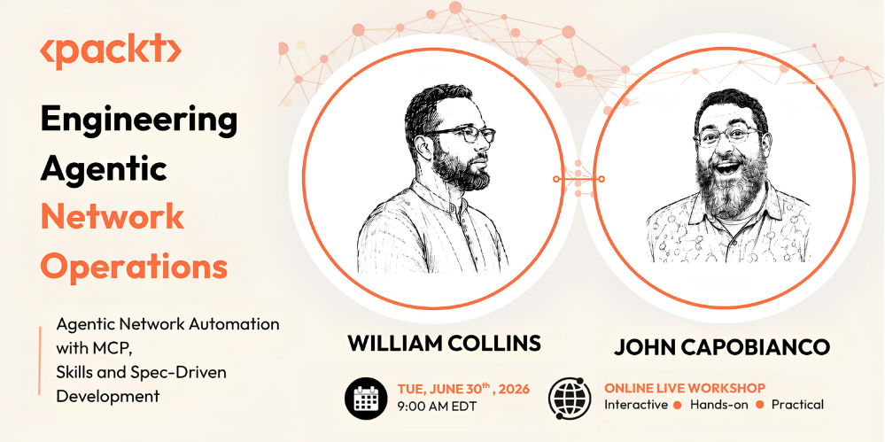

# Getting Started

Skim this page before the workshop. It is the one-page picture of what you will
build, plus the commands that get you from a clean machine to a running lab.



## Workshop progress checklist

Use this to track where you are. Each item has a visible green checkpoint.

- [ ] Repo cloned in the correct environment (on macOS, inside the OrbStack VM)
- [ ] Setup guides 00-05 pass `./scripts/verify-setup.sh`
- [ ] Fabric deployed and smoke test green
- [ ] Lab 1: 1a -> 1b -> 1c complete
- [ ] Lab 2: drift observed -> spec tightened -> rerun holds
- [ ] `./scripts/checkpoint.sh` reports midpoint state GREEN

## On macOS, everything lives in one place

> On macOS, your terminal prompt, repo clone, Docker, Containerlab, Gridctl, and
> your MCP client all live inside the OrbStack VM (`orb -m clab`). They must share
> one host. If `docker exec clab-skills-specs-lab-leaf1 ...` fails with "no such
> container", you are almost certainly in the wrong shell (the macOS host instead
> of the VM). Enter the VM with `orb -m clab` and try again.

## What we are building

This is the Skills & Specs Lab, Part 1 of the Packt workshop "Engineering
Agentic Network Operations". You will learn to build reliable AI agents for
network operations using three layers: MCP tools, agent skills, and behavioral
specs. There are two modules:

- Module 1 (Tools to Skills): wrap raw MCP tools in structured, composable
  skills and chain them into a workflow against a live network fabric.
- Module 2 (Spec-Driven Development): write behavioral specs, watch where an
  agent drifts, and tighten the spec without changing agent code.

The lab fabric is a small spine-leaf topology of Nokia SR Linux nodes, deployed
with Containerlab and running an eBGP underlay:

- Two spines (`spine1`, `spine2`) and two leaves (`leaf1`, `leaf2`).
- Nokia SR Linux, image `ghcr.io/nokia/srlinux:25.10.2`, Containerlab kind
  `nokia_srlinux`, type `ixr-d2l`.
- Container names follow `clab-skills-specs-lab-<node>`.
- Device credentials are `admin` / `admin` (set in the startup-configs; this
  overrides the Containerlab default of `admin` / `NokiaSrl1!`).

Your AI client (Claude Code is the worked example, but any MCP client works)
talks to a Gridctl MCP gateway. Gridctl serves the workshop's skills as MCP
prompts and, optionally, exposes the fabric through a read-only Containerlab MCP
server (one-command setup: `./scripts/setup-clab-mcp.sh`). You deploy the fabric
yourself with `./scripts/deploy.sh`; an agent never deploys it.

Host note: Containerlab needs Linux. On macOS (Apple Silicon) you run everything
inside an OrbStack arm64 Debian Linux VM. Windows users use WSL2. Linux users run
natively. Full details are in [setup/01-docker-containerlab.md](setup/01-docker-containerlab.md).

## Quick start

Do the full setup once, in order, following the guides in
[setup/README.md](setup/README.md). The condensed command sequence is below. On
macOS, run every command inside the OrbStack VM (`orb -m clab`).

```bash
# 0. Get the repo (on macOS, clone INSIDE the OrbStack VM; see setup/00)
git clone https://github.com/wcollins/skills-and-specs-lab.git
cd skills-and-specs-lab

# 1. Docker + Containerlab (one script installs both)
brew install orbstack            # macOS only
orb create debian clab           # macOS only: stable base (avoid bleeding-edge Ubuntu)
orb -m clab                      # macOS only: enter the VM, run the rest here
curl -sL https://containerlab.dev/setup | sudo -E bash -s "all"   # docker + containerlab
sudo usermod -aG docker "$USER"  # then re-login: exit, orb -m clab

# 2. SR Linux image
docker pull ghcr.io/nokia/srlinux:25.10.2

# 3. LLM client (Claude Code shown; any MCP client works). Native installer, no Node needed.
curl -fsSL https://claude.ai/install.sh | bash

# 4. Gridctl: install, apply the stack, import skills, link your client
curl -fsSL https://raw.githubusercontent.com/gridctl/gridctl/main/install.sh | sh
gridctl validate stack.yaml
gridctl apply stack.yaml
gridctl skill add https://github.com/wcollins/skills-and-specs-lab --path skills  # offline fallback: ./scripts/load-skills.sh
gridctl link claude-code

# 5. Verify (run inside the OrbStack VM on macOS)
./scripts/verify-setup.sh
```

When verification reports "All required checks passed", deploy the fabric and
confirm it converged:

```bash
./scripts/deploy.sh              # deploy the SR Linux fabric (never run by an agent)
./scripts/smoke-test.sh          # confirm interfaces and BGP are up
```

The gateway web UI is at `http://localhost:8180`. You are ready for Module 1.

## Day-of checklist (live session)

Five things to do the moment you sit down, before the room starts:

1. Open your working environment (on macOS, `orb -m clab`).
2. `cd` to the repo (`cd skills-and-specs-lab`).
3. `gridctl status` shows the gateway and `clab` server healthy.
4. `./scripts/smoke-test.sh` prints the green "Fabric healthy" line.
5. Open [lab-01/README.md](lab-01/README.md) and wait for the go.

If any of those are not green, fix them before the session starts, or flag it in
chat. A quick reference for the commands you use most is in
[docs/quick-reference.md](docs/quick-reference.md).
